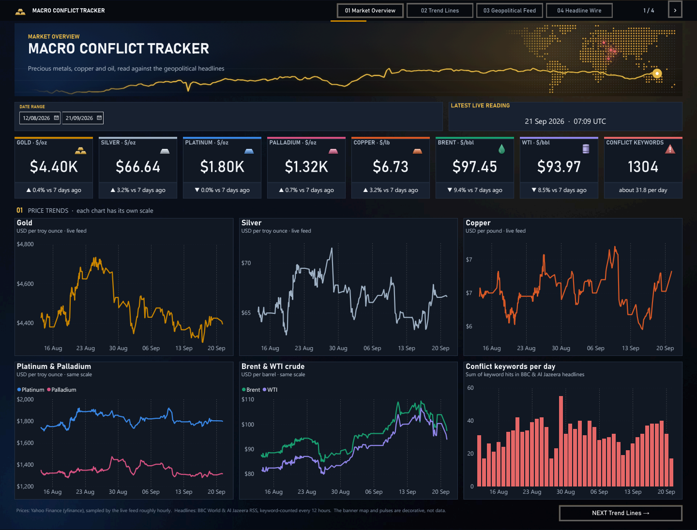
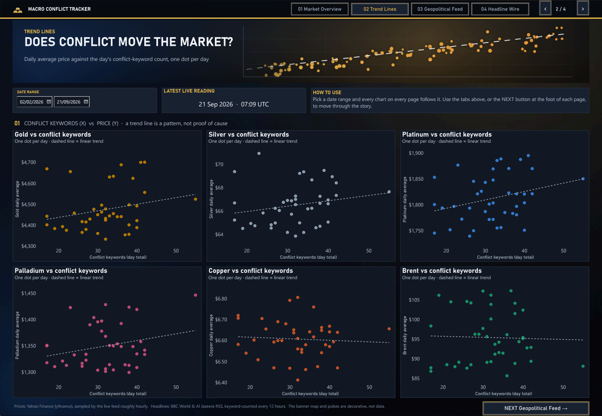
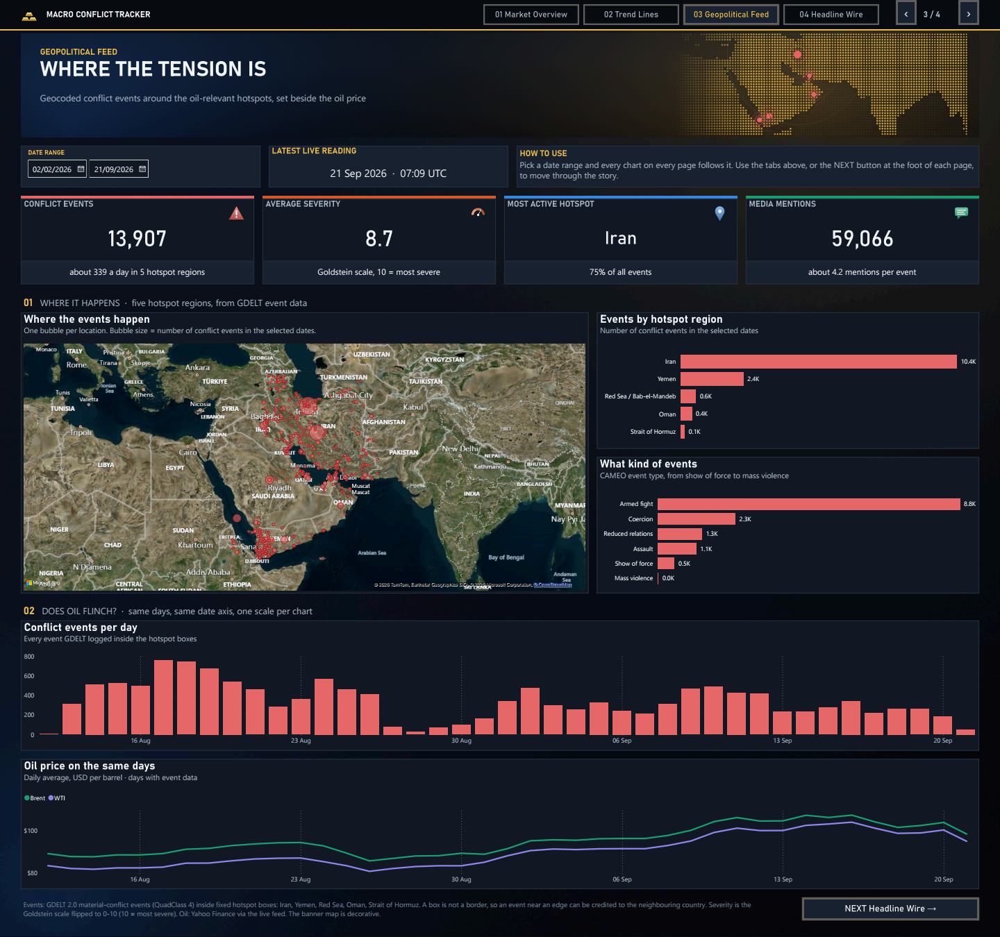
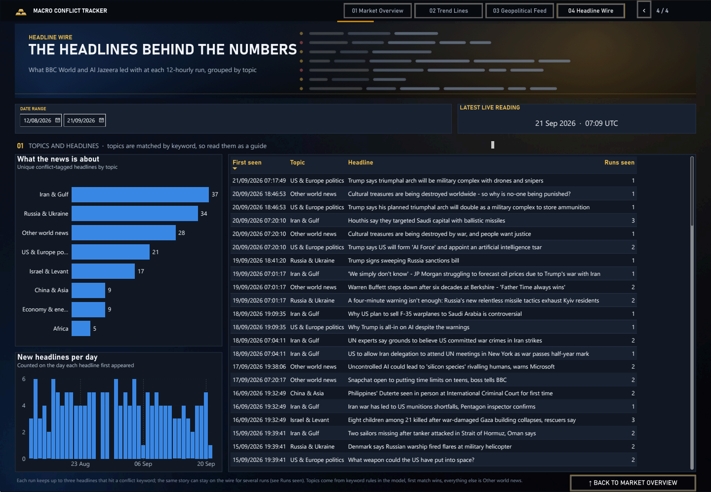

# 📈 Global Macro Metals, Energy & Conflict Tracker

A quiet background pipeline that keeps an eye on metals, oil, and geopolitical tension, and turns it into something you can actually look at — a four-page Power BI dashboard fed by data that collects itself while you're doing literally anything else.

## 📊 The Dashboard

A four-page Power BI report over all three feeds. Every page shares one date-range filter, and the tabs at the top (or the **NEXT** button at the foot of each page) walk through the story in order.

> **Data coverage.** The war began on 28 February 2026, but this tracker only started collecting on 12 August. To give the price charts a "before" picture, **prices were back-filled** from Yahoo Finance's hourly history to 2 February 2026 (`backfill_price_history.py` writes `history/price_history.csv`, a one-off file that no GitHub Action touches). Everything else (keyword counts, headlines, conflict events) is only what the tracker itself recorded since 12 August; it was not back-filled.

### 1 · Market Overview

Seven live price cards (gold, silver, platinum, palladium, copper, Brent, WTI) each showing the latest reading and its change against seven days earlier, then six trend charts that run from 2 February, so the weeks before and after 28 February are on screen. Metals and oil trade at very different price levels, so every chart keeps **one axis and its own scale**; platinum with palladium and Brent with WTI share a chart only because their prices are close enough to sit on the same scale. The last chart counts conflict keywords per day.

### 2 · Trend Lines

The question this project exists to ask: do days with more conflict language in the headlines look different in the market? One dot per day, conflict-keyword count on the x-axis, average price on the y-axis, with a linear trend line. A trend line shows a pattern, not a cause.

### 3 · Geopolitical Feed

Geocoded conflict events from GDELT inside the oil-relevant hotspots (Iran, Yemen, the Red Sea, Oman, the Strait of Hormuz): a bubble map, events by region and by type, and events per day stacked directly above the daily Brent and WTI prices on the same date axis so the two can be compared by eye. See [the conflict hotspot map](#conflict-hotspot-map-conflict_eventsdb) below for how the events are selected and where they can mislead.

### 4 · Headline Wire

The headlines behind the keyword count, one per row, with the date each first appeared and how many runs it stayed on the feed. Topics are assigned by keyword rules inside the Power BI model (first match wins, everything else is "Other world news"), so read them as a guide rather than a classification.

## 🧾 Logged Indicators
* **Safe Havens:** Gold, Silver
* **Industrial Metals:** Platinum, Palladium, Copper
* **Energy:** Brent Crude, WTI Crude
* **Geopolitical Risk:** Conflict keyword frequency & RSS summary

## 🗃️ Three Data Feeds

This repo runs three independent, differently-scoped pipelines. They can look redundant at a glance — three things all tracking metals and oil — but they're not duplicates, they're just sampling the same world at different resolutions and for different purposes:

| | `commodity_prices.csv` | `live_prices.db` | `conflict_events.db` |
|---|---|---|---|
| Script | `tracker.py` | `live_prices.py` | `conflict_map_tracker.py` |
| Cadence | Every 12 hours | Every hour | Every hour |
| Covers | All 7 assets + geopolitical conflict signal (keyword count) | All 7 assets (no conflict signal) | Geocoded conflict/attack events in named oil-relevant hotspots |
| Feeds | Market Overview, Trend Lines and Headline Wire pages | Market Overview price cards and charts | Geopolitical Feed map and event charts |

**Back-filled history:** `history/price_history.csv` holds hourly prices for the same seven assets from 2 Feb to 13 Aug 2026, made once by `backfill_price_history.py` (same Yahoo Finance tickers as `tracker.py`) so the charts cover the weeks before the war too. The Power BI price table joins it to `live_prices.db`; nothing else was back-filled.

Use the CSV for the broad macro/geopolitical picture and correlation analysis; use the SQLite dbs for finer-grained hourly history. Don't expect the numbers to line up exactly across feeds at any given moment — they're sampled on different schedules, so a small mismatch between, say, the CSV's gold price and the live tracker's gold price at "the same" hour is expected, not a bug.

### Conflict hotspot map (`conflict_events.db`)

Sourced from [GDELT 2.0](https://www.gdeltproject.org/) — a free, real-time, already-geocoded global event database (updated every 15 minutes, no API key required) — filtered to `QuadClass == 4` (material/physical conflict, not just verbal tension) and to a fixed set of oil-relevant hotspot bounding boxes: **Strait of Hormuz, Iran, Kuwait, Bahrain, Oman, Yemen, Red Sea/Bab-el-Mandeb**.

This was chosen over extracting locations from the existing RSS conflict-keyword feed, since a headline merely *mentioning* a place name isn't evidence an event happened there — GDELT gives real geocoded, classified events instead.

**Known limitation:** hotspots are rectangular lat/long boxes, not precise borders, so an event right at a hotspot's edge can occasionally get attributed to the wrong country — caught this once in testing, where a Dubai/UAE dateline landed inside Iran's box. Nothing to fix here really, just treat the map as a density view of activity in the broader region rather than a precise per-country count.

Each row is unique per GDELT's own `global_event_id`, so re-running the tracker (or its 15-minute fetch windows overlapping across hourly runs) never creates duplicates — safe to re-run as often as you like.

**Not yet built:** a statistical test of the price question — does gold actually rise, does oil actually spike, when a hotspot event happens? The Geopolitical Feed page only lines events and oil up on a shared date axis so the two can be compared by eye; a real analysis needs more history to accumulate first, same as the other two feeds.

## 📈 Power BI

Both versions of the report live in [`powerbi/`](powerbi/):

| File | What it is |
|---|---|
| [`MacroConflictTracker_v2_claude_and_mine.pbip`](powerbi/MacroConflictTracker_v2_claude_and_mine.pbip) | The current four-page dashboard shown above, built on top of my first version together with Claude. Open it in Power BI Desktop. |
| [`MacroConflictTracker_v1_mine.pbix`](powerbi/MacroConflictTracker_v1_mine.pbix) | My original single-page report, built by hand on the shorter data history. Kept for reference. |

The report reads the local copies of the data, so refreshing after a tracker update is `git pull`, then Refresh. The committed report does not update itself when the data changes on GitHub, which is the one manual step in an otherwise self-running pipeline.

**One-time setup on a new machine (v2)**
1. Install a 64-bit SQLite ODBC driver and create two **User DSNs** with these exact names: `tracking_metals_live` pointing at `live_prices.db`, and `conflict_events_live` pointing at `conflict_events.db`.
2. Three queries read CSV files from an absolute path: `commodity_prices` and `headline_log` (`commodity_prices.csv`) and `live_commodity_prices` (`history/price_history.csv`). Change the `File.Contents(...)` path in each to your clone (Transform data, then Advanced Editor).
3. Refresh. The price table combines a database and a CSV, so Power BI asks for privacy levels the first time: choose **Organizational** for both sources.

## 🔮 Gold Price Forecasting (v1)

`forecasting_gold/` is a different kind of piece from the other three feeds above: it doesn't collect anything new, it *consumes* `live_prices.db`'s `gold_usd_oz` series, which needed zero new collection code to exist.

Once a day (`gold_forecast.py`, scheduled 23:30 UTC — late enough that the hourly price feed has covered nearly the full day first):
1. **Score** — resolves yesterday's prediction against the real closing price that's now available and records the error in `gold_scoreboard`.
2. **Predict** — forecasts tomorrow's close with two models and records both in `gold_predictions`:
   - **naive** — tomorrow = today's last price. The floor every real model has to clear.
   - **prophet** — Facebook/Meta's Prophet, fit fresh each run on the full daily-resampled history.

Both tables live in their own `forecasting_gold/predictions.db`, separate from `live_prices.db`, since the two run on independent schedules (hourly vs. daily) as independent GitHub Actions jobs — a shared file would mean the two writers racing each other.

**Honest expectation-setting:** the dataset started 2026-08-13, so early scoreboard rows are working off well under two weeks of history — a naive guess and Prophet won't be meaningfully different at that scale, and Prophet is not guaranteed to beat the naive baseline at all. That's the actual point of running both: whether Prophet earns its keep over "just guess today's price again" is a real, reportable question the scoreboard exists to answer as history accumulates, not a foregone conclusion.

Daily close = the *last* observed price of the calendar day (UTC), not a daily mean — chosen so "today" stays a single point, which is what keeps the naive baseline's "tomorrow = today" comparison coherent.

## 🤖 Planned: AI Insights Layer (not yet active)

There's an idea sitting on the shelf for this one: use Claude to write short, plain-English commentary on top of the price and conflict data, and store that commentary in a new `ai_insights.db` right alongside everything else. Nothing's built yet — no code in the pipeline for it — but the shape of it is worked out:

| Trigger | Runs from | Produces |
|---|---|---|
| Hourly anomaly check | `live_prices.py` | Short explanation when an asset moves >~2% in an hour |
| Conflict-spike check | `tracker.py` | Classifies the likely driving event behind a `conflict_keyword_count` spike |
| Daily digest | new daily cron | Executive-style narrative summary of the day's data |

All three would share one small module (`ai_analyst.py`: a `call_claude()` wrapper and a `write_insight()` helper) writing into a single `ai_insights` table (`timestamp, insight_type, related_asset, trigger_value, source_text, ai_commentary, event_tag, severity`) — one fact table Power BI could slice by type, asset, or severity right alongside the price data above.

It's a small, cheap thing to turn on whenever it's worth doing — just hasn't happened yet.
