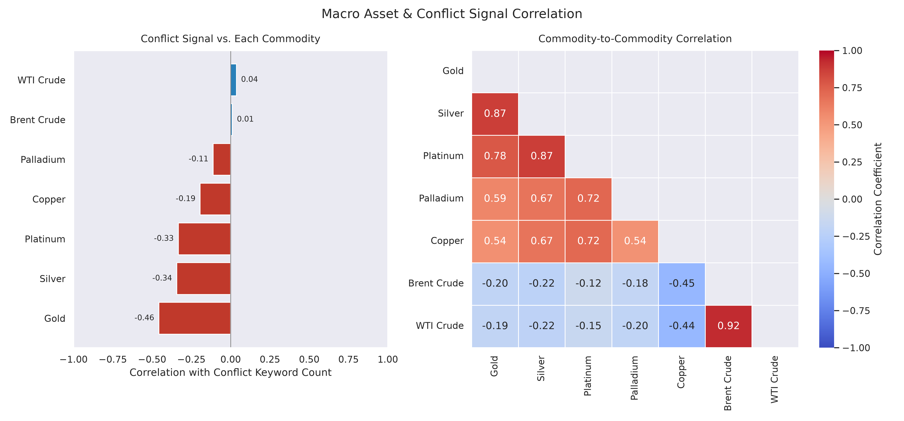

# 📈 Global Macro Metals, Energy & Conflict Tracker

A quiet background pipeline that keeps an eye on metals, oil, and geopolitical tension, and turns it into something you can actually look at — a correlation heatmap and a Power BI report, both fed by data that collects itself while you're doing literally anything else.

## 📊 Live Correlation Heatmap

### Logged Indicators
* **Safe Havens:** Gold, Silver
* **Industrial Metals:** Platinum, Palladium, Copper
* **Energy:** Brent Crude, WTI Crude
* **Geopolitical Risk:** Conflict keyword frequency & RSS summary

## 🗃️ Three Data Feeds

This repo runs three independent, differently-scoped pipelines. They can look redundant at a glance — three things all tracking metals and oil — but they're not duplicates, they're just sampling the same world at different resolutions and for different purposes:

| | `commodity_prices.csv` | `live_prices.db` | `conflict_events.db` |
|---|---|---|---|
| Script | `tracker.py` | `live_prices.py` | `conflict_map_tracker.py` |
| Cadence | Every 12 hours | Every hour | Every hour |
| Covers | All 7 assets + geopolitical conflict signal (keyword count) | All 7 assets (no conflict signal) | Geocoded conflict/attack events in named oil-relevant hotspots |
| Feeds | `generate_heatmap.py` correlation heatmap | — (raw time series) | — (raw time series, for a future map visual) |

Use the CSV for the broad macro/geopolitical picture and correlation analysis; use the SQLite dbs for finer-grained hourly history. Don't expect the numbers to line up exactly across feeds at any given moment — they're sampled on different schedules, so a small mismatch between, say, the CSV's gold price and the live tracker's gold price at "the same" hour is expected, not a bug.

### Conflict hotspot map (`conflict_events.db`)

Sourced from [GDELT 2.0](https://www.gdeltproject.org/) — a free, real-time, already-geocoded global event database (updated every 15 minutes, no API key required) — filtered to `QuadClass == 4` (material/physical conflict, not just verbal tension) and to a fixed set of oil-relevant hotspot bounding boxes: **Strait of Hormuz, Iran, Kuwait, Bahrain, Oman, Yemen, Red Sea/Bab-el-Mandeb**.

This was chosen over extracting locations from the existing RSS conflict-keyword feed, since a headline merely *mentioning* a place name isn't evidence an event happened there — GDELT gives real geocoded, classified events instead.

**Known limitation:** hotspots are rectangular lat/long boxes, not precise borders, so an event right at a hotspot's edge can occasionally get attributed to the wrong country — caught this once in testing, where a Dubai/UAE dateline landed inside Iran's box. Nothing to fix here really, just treat the map as a density view of activity in the broader region rather than a precise per-country count.

Each row is unique per GDELT's own `global_event_id`, so re-running the tracker (or its 15-minute fetch windows overlapping across hourly runs) never creates duplicates — safe to re-run as often as you like.

**Not yet built:** the actual price-correlation analysis — does gold actually rise, does oil actually spike, when a hotspot event happens? That's the interesting question this feed exists to eventually answer, but it needs real history to accumulate first, same as the other two feeds.

## 📈 Power BI

[`connections_relationships_between_commodity_and_live_commodity.pbix`](connections_relationships_between_commodity_and_live_commodity.pbix) is a ready-made Power BI report connecting `live_prices.db` (via ODBC) and `commodity_prices.csv` (natively). Open it in Power BI Desktop; since it reads local files, refreshing after a tracker update is `git pull` then Refresh — the committed `.pbix` itself doesn't auto-update just because the underlying data changed on GitHub. Worth remembering, since it's the one manual step in an otherwise self-running pipeline.

`conflict_events.db` isn't wired into the `.pbix` yet. When it is, add it as a second ODBC DSN (same driver as `live_prices.db`) and use Power BI's Map/bubble-map visual with `lat`/`long` as location, event count or `SUM(ABS(goldstein_scale))` as size, and `hotspot_region` as color/legend.

## 🤖 Planned: AI Insights Layer (not yet active)

There's an idea sitting on the shelf for this one: use Claude to write short, plain-English commentary on top of the price and conflict data, and store that commentary in a new `ai_insights.db` right alongside everything else. Nothing's built yet — no code in the pipeline for it — but the shape of it is worked out:

| Trigger | Runs from | Produces |
|---|---|---|
| Hourly anomaly check | `live_prices.py` | Short explanation when an asset moves >~2% in an hour |
| Conflict-spike check | `tracker.py` | Classifies the likely driving event behind a `conflict_keyword_count` spike |
| Daily digest | new daily cron | Executive-style narrative summary of the day's data |

All three would share one small module (`ai_analyst.py`: a `call_claude()` wrapper and a `write_insight()` helper) writing into a single `ai_insights` table (`timestamp, insight_type, related_asset, trigger_value, source_text, ai_commentary, event_tag, severity`) — one fact table Power BI could slice by type, asset, or severity right alongside the price data above.

It's a small, cheap thing to turn on whenever it's worth doing — just hasn't happened yet.
